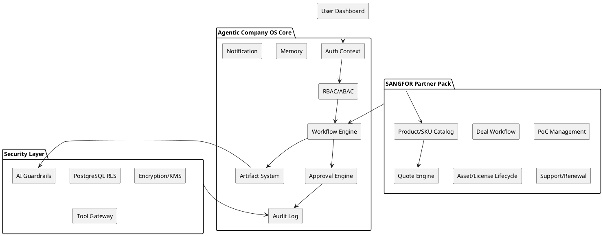

# SPEC-3-Agentic-Company-OS-SANGFOR-Partner-OS-Final

## Background

현재 목표는 특정 개발 업무 자동화가 아니라, 여러 업종으로 확장 가능한 **Agentic Company Operating System**을 구축하는 것이다. 이 OS는 회사 업무를 워크플로우, 산출물, 승인, 메모리, 감사 로그로 모델링한다.

첫 번째 실전 Industry Pack은 **SANGFOR Platinum Partner IT Company Pack**이다. SANGFOR 공식 파트너 프로그램은 Certified, Gold, Platinum tier를 제공하며 Partner ONE 포털을 통해 파트너 운영 자료와 워크플로우를 제공한다. SANGFOR는 Cybersecurity, Cloud, Infrastructure 영역의 제품군을 제공하므로 파트너 회사의 업무는 단순 CRM보다 제품/SKU/라이선스/PoC/구축/지원/갱신 운영에 가깝다.

## Vision

```text
Every company operation is a workflow.
Every workflow produces artifacts.
Every artifact has owner, reviewer, approval, version, and audit trail.
Every industry is implemented as a configuration pack.
```

## Scope

### Core Scope

- Tenant / Company
- User / Persona / Role / Permission
- Workflow Definition / Workflow Run
- Task
- Artifact / Artifact Version
- Approval Gate
- Audit Log
- Memory
- Notification
- Dashboard
- Industry Pack Registry

### SANGFOR Pack Scope

- Customer
- Opportunity
- Deal Qualification
- Discovery
- Product Family / SKU / License
- Solution Fit Matrix
- Quote / Margin Engine
- Vendor Request
- PoC Plan / Result
- Delivery Plan
- Customer Asset
- License / Subscription
- Support Case / RCA
- Renewal Opportunity
- Engineer Certification Matrix

## Non-Goals for MVP

- 완전 자율 AI 승인
- Partner ONE 포털 직접 API 연동
- Visual DAG Builder
- 대규모 Industry Pack Marketplace
- 복잡한 회계/세금 처리
- 완전한 PSA/ERP 대체

## Requirements

### Must Have

| ID | Requirement | 설명 |
|---|---|---|
| M1 | Domain-Agnostic Core | 업종 독립 Core 구조 |
| M2 | Industry Pack | SANGFOR Pack을 설정/seed 데이터로 설치 |
| M3 | Multi-tenant Ready | 모든 업무 데이터는 tenant/company scope |
| M4 | AuthContext | 모든 API는 인증된 user/tenant/company context 사용 |
| M5 | RBAC + ABAC | 역할과 업무 배정 기반 권한 |
| M6 | PostgreSQL RLS | DB 레벨 tenant 격리 |
| M7 | Approval Gate | 자동 검증과 사람 승인 분리 |
| M8 | Audit Integrity | append-only, hash chain audit |
| M9 | Artifact Versioning | AI Draft와 Approved Artifact 분리 |
| M10 | Deal Workflow | Lead부터 Proposal까지 추적 |
| M11 | Quote Engine | line item 기반 서버 마진 계산 |
| M12 | Customer Asset Lifecycle | 구축 후 자산/라이선스/갱신 관리 |
| M13 | AI Quality Gate | AI 산출물 근거·누락·검토 상태 표시 |
| M14 | Role-based Dashboard | 사용자/운영자/관리자별 화면 |
| M15 | Operational Runbook | 장애, 복구, 백업, 보안 이벤트 대응 |

### Should Have

| ID | Requirement | 설명 |
|---|---|---|
| S1 | Vendor Request Workflow | 특별가, 데모 라이선스, 벤더 escalation |
| S2 | Certification Matrix | 엔지니어별 제품군 역량 |
| S3 | Renewal Automation | 만료일 기준 갱신 Opportunity 생성 |
| S4 | Support SLA Engine | severity별 응답/복구 SLA |
| S5 | ROI Dashboard | 업무 절감과 매출 효과 추적 |
| S6 | Notification Policy | 승인, 지연, 갱신, 비용 경고 |
| S7 | Product-family Discovery Templates | HCI/VDI/NGFW/EPP/XDR/MDR/SASE별 discovery |
| S8 | Data Subject Request Workflow | 개인정보/고객정보 삭제·보존 요청 |

### Could Have

| ID | Requirement | 설명 |
|---|---|---|
| C1 | Visual Workflow Builder | 업무 흐름 시각 편집 |
| C2 | Partner Portal Adapter | SANGFOR Partner ONE 수동/자동 연계 |
| C3 | Pack Marketplace | 업종 Pack 설치/공유 |
| C4 | Advanced Forecast AI | 제품군별 매출 예측 |
| C5 | External CRM/Accounting Integrations | CRM, 회계, 티켓 시스템 연동 |

### Won't Have in MVP

| ID | Requirement | 설명 |
|---|---|---|
| W1 | Autonomous Customer Communication | AI 단독 고객 발송 금지 |
| W2 | Full ERP Replacement | 세무/회계 ERP 대체 제외 |
| W3 | Full Vendor API Automation | 벤더 API 직접 자동화 제외 |
| W4 | No-human Production Approval | 사람 승인 없는 고위험 action 금지 |

## Method Overview



## Implementation Strategy

MVP는 네 단계로 구현한다.

1. Foundation: 인증, 권한, 테넌트, RLS, 감사 로그
2. Partner Workflow: 고객, Opportunity, Qualification, Discovery, Solution Fit
3. Commercial: Product/SKU, Quote Line Items, Margin, Approval
4. Asset/Renewal/Support Seed: 고객 자산, 라이선스, 갱신 알림, Support Case

AI는 MVP에서 보조 기능으로 제한한다.

- Lead Summary
- Discovery Question Generator
- Proposal Draft
- RCA Draft

## Gathering Results

성공 판단은 다음 지표를 기준으로 한다.

| 분야 | 지표 |
|---|---|
| 영업 | lead conversion, win rate, sales cycle |
| 견적 | quote turnaround, margin error, approval time |
| PoC | PoC success rate, conversion rate |
| 구축 | on-time delivery, first-pass acceptance |
| 지원 | SLA compliance, RCA completion time |
| 갱신 | renewal rate, churn, upsell amount |
| AI | rejection rate, correction rate, citation coverage |
| 보안 | authorization failure, RLS test pass, audit integrity |
| ROI | time saved, low-margin deal avoided, renewal recovered |


## V3.1 Coverage Patch Summary

V3.1은 V3 최종 검증 결과의 gap을 닫기 위해 다음 항목을 정식 범위에 포함한다.

### Code Skeleton 100% Coverage 기준

```text
- Core workflow schema 존재
- SANGFOR partner business schema 존재
- data/AI governance schema 존재
- tenant/company RLS skeleton 존재
- OIDC/JWT Auth adapter skeleton 존재
- vendor/discount/PoC/asset/renewal/support/certification API skeleton 존재
- copy/download/export/watermark audit model 존재
- AI Golden Answer Set model 존재
```

### 새로 추가된 Must Have

| ID | Requirement | 설명 |
|---|---|---|
| M13 | Vendor Request Operations | deal registration, special discount, demo license, technical escalation을 추적한다. |
| M14 | Asset & License Lifecycle | 구축 완료 후 asset, license, subscription, renewal opportunity를 생성한다. |
| M15 | Certification Matrix | 엔지니어별 SANGFOR 제품군 역량과 인증을 관리한다. |
| M16 | Data Export Governance | copy/download/export/share/print를 별도 권한과 감사 이벤트로 관리한다. |
| M17 | AI Golden Answer Evaluation | AI prompt/model 변경은 Golden Answer Set 평가를 통과해야 운영 반영된다. |

### V3.1 Caveat

V3.1의 100%는 합의된 설계 항목이 **문서와 skeleton에 누락 없이 반영되었다는 의미**다. 운영 배포를 위해서는 외주 개발팀이 실제 DB migration, repository, endpoint persistence, OIDC provider, integration test를 구현해야 한다.
