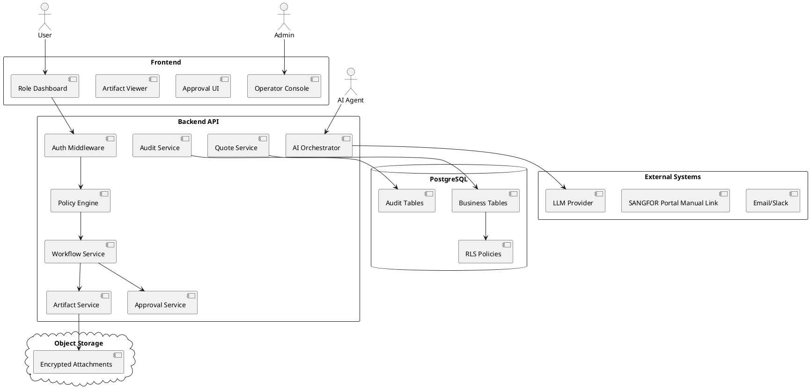

# Core Architecture

## 설계 원칙

Agentic Company OS Core는 어떤 업종에도 공통으로 적용되는 운영 엔진이다. SANGFOR Partner Pack은 이 Core 위에 설치되는 첫 Industry Pack이다.

## Core Modules

```text
Tenant / Company
User / Persona / Role / Permission
Workflow Definition / Workflow Run / Task
Artifact / Artifact Version
Approval Gate
Audit Log
Memory
Notification
Industry Pack Registry
Tool Gateway
AI Gateway
Dashboard
```

## Logical Architecture



## 주요 Aggregate

### Tenant

SaaS 확장을 위한 최상위 격리 단위.

### Company

tenant 내 운영 회사. MVP에서는 하나의 tenant에 하나의 company로 시작해도 된다.

### Persona

업무 역할이다. 예: CEO, Sales Manager, Presales Engineer, Solution Architect, Finance Manager, Delivery Engineer, Support Engineer, Security Officer.

### Workflow Definition

업무 절차의 버전 정의. active workflow는 직접 수정하지 않고 새 버전을 생성한다.

### Workflow Run

특정 고객/Opportunity에 대해 실행된 workflow instance.

### Artifact

문서, 제안서, 견적서, RCA, PoC 결과, 구축 체크리스트 등 모든 산출물.

### Approval Gate

자동 검증과 사람 승인을 분리한다.

### Audit Log

업무, 승인, 권한, 데이터 export, AI action, tool call을 append-only로 기록한다.

## Industry Pack 구조

```json
{
  "pack_key": "sangfor_partner_it_company",
  "version": "3.0.0",
  "personas": [],
  "workflow_templates": [],
  "artifact_templates": [],
  "product_families": [],
  "approval_policies": [],
  "dashboard_views": []
}
```

## Core vs Pack 경계

| Core | Pack |
|---|---|
| Workflow Engine | SANGFOR Deal Workflow |
| Artifact System | Discovery Note, Proposal, RCA |
| Approval Engine | Commercial Gate, PoC Gate |
| Product abstraction | SANGFOR SKU/License seed |
| Dashboard framework | Sales/Presales/CEO dashboard |
| RBAC/ABAC | SANGFOR persona mapping |
