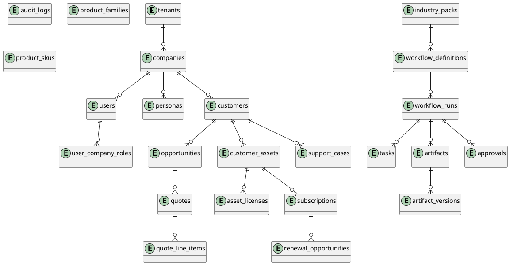

# Database ERD & Schema

## 핵심 ERD



## 핵심 DDL 요약

전체 skeleton SQL은 `10_CODE_SKELETON/db/schema.sql` 참고.

### 공통 컬럼

대부분의 business table은 다음을 가진다.

```sql
tenant_id UUID NOT NULL,
company_id UUID NOT NULL,
created_at TIMESTAMPTZ NOT NULL DEFAULT now(),
updated_at TIMESTAMPTZ NOT NULL DEFAULT now()
```

### Quote Line Item

```sql
CREATE TABLE quote_line_items (
  id UUID PRIMARY KEY DEFAULT gen_random_uuid(),
  tenant_id UUID NOT NULL,
  company_id UUID NOT NULL,
  quote_id UUID NOT NULL REFERENCES quotes(id),
  product_sku_id UUID REFERENCES product_skus(id),
  line_type TEXT NOT NULL CHECK (line_type IN ('product','service','discount','expense')),
  description TEXT NOT NULL,
  quantity NUMERIC(14,2) NOT NULL CHECK (quantity > 0),
  unit_price NUMERIC(14,2) NOT NULL CHECK (unit_price >= 0),
  unit_cost NUMERIC(14,2) NOT NULL CHECK (unit_cost >= 0),
  discount_percent NUMERIC(5,2) NOT NULL DEFAULT 0 CHECK (discount_percent >= 0 AND discount_percent <= 100)
);
```

### Margin 계산

마진은 저장값을 신뢰하지 않고 서버에서 계산한다.

```text
revenue = sum(quantity * unit_price * (1 - discount_percent/100))
cost = sum(quantity * unit_cost)
margin_percent = (revenue - cost) / revenue * 100
```

## RLS 원칙

PostgreSQL Row-Level Security는 per-user 또는 per-context 기준으로 row 접근을 제한할 수 있다. 본 설계에서는 DB session에 `app.tenant_id`, `app.company_id`를 설정하고 모든 business table에 RLS를 적용한다.

```sql
ALTER TABLE customers ENABLE ROW LEVEL SECURITY;
ALTER TABLE customers FORCE ROW LEVEL SECURITY;

CREATE POLICY tenant_company_isolation_customers
ON customers
USING (
  tenant_id::text = current_setting('app.tenant_id', true)
  AND company_id::text = current_setting('app.company_id', true)
)
WITH CHECK (
  tenant_id::text = current_setting('app.tenant_id', true)
  AND company_id::text = current_setting('app.company_id', true)
);
```

## DB Role 분리

| Role | 목적 | 제한 |
|---|---|---|
| migrator_role | migration 전용 | 앱 런타임 사용 금지 |
| app_role | 일반 API | BYPASSRLS 금지, DDL 금지 |
| readonly_support_role | 제한 조회 | restricted 기본 차단 |
| audit_writer_role | audit append | update/delete 금지 |

## Cross-tenant FK 원칙

가능하면 `(tenant_id, company_id, id)` 복합 unique와 복합 FK를 사용한다.

```sql
ALTER TABLE customers ADD CONSTRAINT customers_tenant_company_id_uk
UNIQUE (tenant_id, company_id, id);
```


## V3.1 보강 — 전체 Core + SANGFOR Partner Operations Entity Coverage

V3.1 code skeleton의 `schema.sql`은 다음 엔티티를 모두 포함한다.

### Core Company OS

```text
tenants
companies
users
user_company_roles
role_change_requests
personas
industry_packs
workflow_definitions
workflow_runs
tasks
artifacts
artifact_versions
artifact_access_events
approvals
approval_override_requests
audit_logs
```

### SANGFOR Partner Business

```text
customers
competitors
opportunities
deal_qualification_scores
product_families
license_metrics
product_skus
sizing_templates
compatibility_rules
quotes
quote_line_items
quote_service_line_items
discount_requests
vendor_requests
vendor_request_events
poc_projects
poc_resources
demo_licenses
delivery_projects
customer_assets
asset_licenses
subscriptions
maintenance_contracts
renewal_opportunities
support_sla_policies
support_cases
vendor_escalations
engineer_certifications
skill_matrix
```

### Data / AI Governance

```text
data_export_requests
ai_prompt_templates
ai_models
ai_evaluation_datasets
ai_golden_answers
ai_quality_results
ai_prompt_runs
```

## V3.1 RLS Coverage

`10_CODE_SKELETON/db/rls.sql`는 tenant/company scoped table 전체에 `ENABLE ROW LEVEL SECURITY`와 `FORCE ROW LEVEL SECURITY`를 적용한다. Runtime `app_role`은 `BYPASSRLS`를 가져서는 안 되며, migration 전용 `migrator_role`과 분리한다.

## V3.1 Append-only 대상

다음 테이블은 운영 권한에서 update/delete를 금지한다.

```text
audit_logs
artifact_access_events
vendor_request_events
ai_prompt_runs
```

## V3.1 데이터 export 모델

```text
View: artifact.read
Copy: artifact.copy + artifact_access_events
Download: artifact.download + signed URL + artifact_access_events
Export: data_export_requests approval workflow
Share: artifact.share + approval workflow
```
