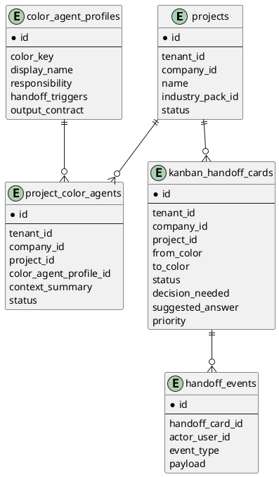

# Hermes Color Agent Architecture

## 개요

Hermes Color Agent Organization은 Agentic Company OS 위에 올라가는 협업 레이어다.

기존 Core 구조:

```text
Tenant
 └── Company
      └── Industry Pack
           └── Workflow / Artifact / Approval / Audit
```

V3.2 추가 구조:

```text
Tenant
 └── Company
      └── Project
           ├── Business Personas
           ├── Color Agents
           │    ├── Blue
           │    ├── Red
           │    ├── Orange
           │    ├── Gray
           │    └── Teal
           ├── Kanban Handoff Board
           └── Color Review Gates
```

## Project Cell + Color Guild Model

V3.2는 다음 두 가지 개념을 사용한다.

### Project Cell

하나의 프로젝트 안에 배치된 색상 Agent 집합이다.

```text
Project: SANGFOR Customer A HCI Renewal
 ├── Blue-A
 ├── Red-A
 ├── Orange-A
 ├── Gray-A
 └── Teal-A
```

### Color Guild

여러 프로젝트의 같은 색 Agent가 공유하는 역할 기준이다.

```text
Blue Guild   = 기술 방향과 구현 품질 기준
Red Guild    = 리스크, 보안, 안전 검토 기준
Orange Guild = 고객 가치와 사업성 검토 기준
Gray Guild   = 문서, 근거, 이력 품질 기준
Teal Guild   = UX, 가시성, 디자인 일관성 기준
```

Project Cell은 맥락을 담당하고, Color Guild는 품질 기준을 담당한다.

## Core 엔티티 관계



## Color Agent와 Approval Gate의 관계

Color review는 사람 승인을 대체하지 않는다.

```text
Color Review = 관점별 품질 검토
Approval Gate = 공식 승인 결정
Audit Log = 결정과 근거의 영구 기록
```

예:

```text
Commercial Gate 이전:
- Orange: 고객 가치와 수주 가능성 검토
- Red: 할인율/마진/계약 리스크 검토
- Gray: 견적 근거, 버전, 승인 자료 정리
- Finance/CEO: 공식 승인
```

## 운영 원칙

1. Color Agent는 기존 Persona를 대체하지 않는다.
2. Color Agent는 자동 판단을 하더라도 고위험 업무에서는 사람 승인을 요구한다.
3. 모든 handoff는 Kanban card로 남긴다.
4. Handoff card는 audit log와 연결한다.
5. Color Agent routing은 risk-based로 동작한다.
6. 같은 프로젝트 안의 Agent만 기본 협업 범위로 한다.
7. Cross-project 협업은 Color Guild 기준으로 제한한다.
