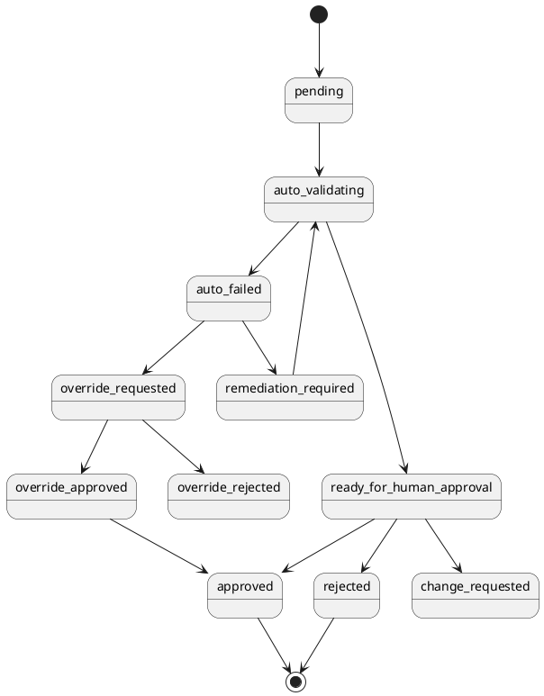

# Workflow & Approval Model

## 표준 업무 흐름

```text
Lead
 → Qualification Gate
 → Deal Registration / Vendor Check
 → Discovery
 → Product-family Sizing
 → Solution Fit Review
 → BoM
 → Vendor Discount / Special Price Request
 → Quote Simulation
 → Commercial Approval
 → Proposal Approval
 → PoC Resource Reservation
 → PoC Execution
 → PoC Result / Conversion Review
 → SOW
 → Delivery Readiness Review
 → Deployment
 → License / Asset Activation
 → Customer Acceptance
 → Support Entitlement Start
 → Renewal Automation
 → Upsell Recommendation
```

## Approval State Machine



## 승인 원칙

1. 일반 승인은 `ready_for_human_approval` 상태에서만 가능하다.
2. `pending`, `auto_validating`, `auto_failed` 상태에서는 일반 승인 불가.
3. `auto_failed` override는 CEO + 2인 승인 + 사유 + risk acknowledgement가 필요하다.
4. 승인자는 request body에서 받지 않고 AuthContext에서 서버가 결정한다.
5. 승인 대상 artifact version은 approval 생성 시점의 version으로 고정한다.
6. 승인 이후 artifact가 변경되면 기존 approval은 stale 처리한다.
7. active workflow는 직접 수정 불가하며 새 version 생성 후 승인해야 한다.

## Gate 목록

| Gate | 자동 검증 | 사람 승인 |
|---|---|---|
| G1 Opportunity Gate | 필수 고객/예산/일정/담당자 | Sales Manager |
| G2 Solution Fit Gate | 제품군 매핑, 누락 질문, sizing | Solution Architect |
| G3 Commercial Gate | 마진, 할인, 원가, 서비스 비용 | Finance + CEO |
| G4 Proposal Gate | 고객 발송 가능성, AI Draft 여부 | Sales + Presales |
| G5 PoC Gate | 성공 기준, 리소스, demo license | Presales Lead |
| G6 Delivery Gate | SOW, 일정, 엔지니어 배정 | PM + CEO 조건부 |
| G7 Acceptance Gate | 체크리스트, 고객 확인 | Customer + Delivery Lead |
| G8 Renewal Gate | 만료일, 사용 이력, 지원 이력 | Account Manager |

## Workflow Versioning

```text
workflow_definitions
  id
  pack_id
  key
  version
  definition_json
  definition_hash
  status: draft | review | active | retired
  created_by
  approved_by
```

- 실행 중인 workflow_run은 시작 시 definition snapshot을 저장한다.
- active definition 수정 금지.
- Gate 제거 또는 승인 조건 약화는 Security Officer + CEO 승인 필요.

## Transition Validation

서버는 모든 상태 전이를 검증한다.

| From | To | 조건 |
|---|---|---|
| draft | pending_validation | 필수 artifact 존재 |
| pending_validation | auto_failed | 자동 검증 실패 |
| pending_validation | ready_for_human_approval | 자동 검증 성공 |
| ready_for_human_approval | approved | 승인자 권한 |
| auto_failed | override_requested | CEO override 권한 |
| approved | next_step | 이전 gate approved |
