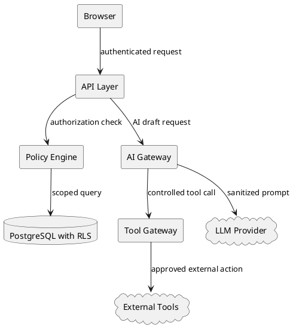

# Security Threat Model

## 보호 대상

- 고객 정보
- 고객 네트워크/보안 구성
- 견적/마진/할인 정보
- 제안서/SOW/계약 관련 문서
- 장애 로그/RCA
- AI prompt/output
- 승인 기록
- 감사 로그
- Industry Pack definition
- Product/SKU/가격 데이터

## 주요 위협

| 위협 | 설명 |
|---|---|
| BOLA | UUID 조작으로 다른 회사/고객 데이터 조회 |
| 권한 상승 | 관리자가 스스로 CEO/Finance 권한 부여 |
| 승인 우회 | auto_failed 상태를 강제 승인 |
| Prompt Injection | 고객 문서가 AI 지시를 오염 |
| Sensitive Info Disclosure | AI/로그/문서 export로 고객 정보 유출 |
| Pack Supply Chain | 악성 Industry Pack 설치 |
| Workflow Tampering | Gate 제거 또는 조건 약화 |
| Audit Tampering | 승인/권한 변경 이력 삭제 |
| Cost DoS | AI/Tool 호출 대량 발생 |
| Insider Export | 내부자가 restricted artifact 다운로드 |

OWASP API Security는 객체 수준 권한 검사를 API 보안의 핵심 위험으로 다루며, OWASP LLM Top 10은 Prompt Injection, Sensitive Information Disclosure, Excessive Agency, Unbounded Consumption 등을 GenAI 애플리케이션 위험으로 분류한다.

## Trust Boundaries

## 보안 요구사항

### Authentication

- OAuth2/OIDC 또는 JWT 기반 인증
- Service account 분리
- MFA for privileged roles
- session timeout

### Authorization

- RBAC + ABAC
- object-level authorization
- assigned deal/customer 조건
- self privilege escalation 금지

### Tenant Isolation

- tenant_id/company_id server-side injection
- PostgreSQL RLS
- FORCE ROW LEVEL SECURITY
- app_role에 BYPASSRLS 금지

### Approval Integrity

- 상태 머신 서버 검증
- approver는 AuthContext 기반
- auto_failed override 별도 절차
- approval target artifact version lock

### AI Security

- untrusted input 분리
- system prompt와 customer document 분리
- tool allowlist
- output schema validation
- human approval before external action

### Audit Integrity

- append-only
- hash chain
- external daily digest
- admin update/delete 금지
- read/export audit

## P0 Abuse Cases

1. 공격자가 다른 tenant의 workflow_run_id를 추측해 조회한다.
2. System Admin이 본인에게 CEO 역할을 부여한다.
3. Sales가 auto_failed quote를 강제 승인한다.
4. 고객 RFP에 prompt injection이 숨어 있다.
5. AI가 고객 네트워크 정보를 외부 tool에 전달한다.
6. Finance가 낮은 마진 quote를 diff 없이 승인한다.
7. 관리자 DB 접근으로 audit log를 삭제한다.
8. workflow definition에서 commercial gate를 제거한다.

## Mitigation Summary

| Abuse | Mitigation |
|---|---|
| BOLA | scoped query + RLS + tests |
| Privilege escalation | 2인 role grant + self-change 금지 |
| Approval bypass | state machine + READY only |
| Prompt injection | AI gateway + source isolation |
| Data leakage | classification + export control |
| Audit tampering | append-only + hash anchor |
| Workflow tampering | versioning + hash + approval |
| Cost DoS | tenant budget + quota + rate limit |
